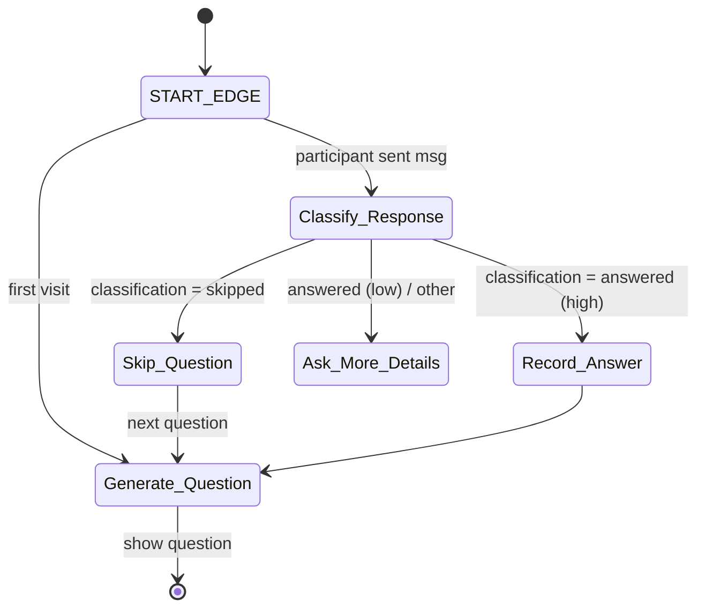

# LLM Survey Bot

A **conversational survey platform** that pairs a **FastAPI + SQLAlchemy** backend with a **React/TypeScript** frontend and orchestrates every interview through a **LangGraph-powered LLM agent**.  
The goal is to keep participants "on-rails" (one question at a time) **while still coping gracefully with real-world behaviour**—skips, clarifications, incomplete answers, or jumping around in the survey.

---

## Table of Contents

1. [Key Features](#key-features)  
2. [Solution Architecture](#solution-architecture)  
3. [Data Model](#data-model)  
4. [HTTP API](#http-api)  
5. [Agent Design (`survey_graph.py`)](#agent-design-survey_graphpy)  
6. [Execution Flow ✦ When Endpoints Are Called](#execution-flow)  
7. [Demo Videos](#demo-videos)  
8. [Getting Started](#getting-started)  
9. [Road-map & Extensions](#road-map--extensions)

---

## Key Features

### Admin

| Capability | Detail |
|------------|--------|
| **Question Management** | CRUD interface; each question may include *optional* "quality-answer guidelines". |
| **Survey Link Generation** | One-click creation of unguessable URLs (`/s/{token}`) bound to a `SurveyLink` row. |
| **Response Analytics** | Scores (1–5), raw answers, and per-question completion rates. |

### Participant

| Capability | Detail |
|------------|--------|
| **Chat-first UX** | Participants meet a bot that asks one question at a time. |
| **Flexible Navigation** | "Skip", "previous question", or "I'm not sure" are recognised intents. |
| **Quality Feedback** | Low-quality answers trigger follow-ups; good answers move on instantly. |

---

## Solution Architecture

```text
┌─────────────┐          HTTPS           ┌──────────────┐
│  React UI   │  ─────────────────────► │  FastAPI     │
│ (TypeScript)│   WebSocket for chat    │  Backend     │
└─────────────┘ ◄────────────────────── │              │
        ▲          Streaming tokens     │              │
        │                               │  LangGraph   │
        │                               │  Agent       │
        │                               └─────▲────────┘
        │                                     │
        │                    SQLAlchemy ORM   │
        ▼                                     │
┌──────────────────┐            ──────────────┘
│  Material-UI     │ DB: SQLite / Postgres in prod
└──────────────────┘
```

### Backend (FastAPI + SQLAlchemy)

| Layer | Tech / Reasoning |
|-------|------------------|
| Framework | **FastAPI** → modern async stack, automatic OpenAPI docs. |
| ORM & DB | **SQLAlchemy** over SQLite (dev) / Postgres (prod). |
| LLM Integration | **LangGraph** orchestrates a multi-node state machine around an OpenAI LLM. |
| Async Tasks | Background tasks enqueue DB writes so chat latency ≈ LLM latency only. |

### Frontend (React + MUI)

| Aspect | Choice |
|--------|--------|
| Build Tooling | Vite + TypeScript for fast HMR. |
| Component Lib | **Material-UI (MUI)** for accessible controls; chat bubbles styled on MUI `Paper`. |
| State | React Query streams WebSocket messages into cache for smooth chat. |

---

## Data Model

### Database Schema

```sql
-- Questions Table
CREATE TABLE questions (
    id INTEGER PRIMARY KEY,
    text TEXT NOT NULL,
    guidelines TEXT
);

-- Survey Links Table
CREATE TABLE links (
    id INTEGER PRIMARY KEY,
    token TEXT UNIQUE
);

-- Answers Table
CREATE TABLE answers (
    id INTEGER PRIMARY KEY,
    question_id INTEGER,
    link_id INTEGER,
    text TEXT,
    score INTEGER,
    FOREIGN KEY (question_id) REFERENCES questions(id),
    FOREIGN KEY (link_id) REFERENCES links(id)
);
```

*Why so simple?*  
Conversational state is checkpointed by LangGraph (key = `thread_id`) so the relational schema only stores **final** answers.

---

## HTTP API

> **Prefix:** `/api` — no auth in demo; add JWT/Auth0 for production.

### Questions

| Method | Path | Purpose | Body |
|--------|------|---------|------|
| `GET`  | `/questions` | List all questions. | – |
| `POST` | `/questions` | Add/replace question. | `{ "text": str, "guidelines": str? }` |

### Links (Survey sessions)

| Method | Path | Purpose | Body |
|--------|------|---------|------|
| `POST` | `/links` | Create survey link. | – |
| `GET`  | `/links/{token}` | Metadata (progress, etc.). | – |
| `POST` | `/links/{token}/start` | First visit → seeds LangGraph, returns first question. | – |
| `POST` | `/links/{token}/message` | Every user message → returns bot reply. | `{ "content": str }` |

### Answers

| Method | Path | Purpose | Body |
|--------|------|---------|------|
| `POST` | `/answers` | Persist a new answer (agent-internal). | `{ "link_id": int, "question_id": int, "text": str, "score": int }` |
| `GET`  | `/links/{link_id}/answers` | All answers & scores for link. | – |

---

## Agent Design (`survey_graph.py`)

### 1. State Schema *(TypedDict)*

| Field | Type | Why it exists |
|-------|------|--------------|
| `current_question` | `Question` | Pointer to the question we should be discussing right now. |
| `classification`   | `ResponseClassification` | Latest evaluation result from the `classify_response` node. |
| `questions`        | `List[Question]` | FIFO queue of remaining questions. |
| `skipped`          | `List[Question]` | To revisit in original order. |
| `answers`          | `dict[str, AnswerRecording]` | Accumulated final answers. |
| `current_messages` | `List[AnyMessage]` | Thread-local transcript for the current question. Each follow-up or clarification stays here so the LLM can deduce a consolidated answer. Cleared once the question is committed. |
| `messages`         | `List[AnyMessage]` | Global transcript so the LLM can reference earlier Q/A when the user jumps around. |
| `link_id`          | `int` | Foreign-key for DB writes. |
| `dev` *(optional)* | `bool` | Inline self-test harness. |

### 2. Node Catalogue

| Node | Core logic |
|------|------------|
| **`classify_response`** | Invokes `response_classifier_llm` with question text, guidelines, and `current_messages`; outputs a *classification* plus an AI rationale message. |
| **`generate_question`** | Emits the next question or reformulates the current one for clarification. |
| **`ask_more_details`** | For low-quality answers: asks follow-ups while retaining `current_question`. |
| **`record_answer`** | Summarises `current_messages`, scores it, saves via `crud.create_answer`, clears `current_messages`, and advances the queue. |
| **`skip_question`** | Pushes `current_question` to the end of the queue so it resurfaces later. |

### 3. Edges & Control Flow



**Highlights**

* **Skipping** simply re-queues the question; after the last question, the skipped ones are replayed.  
* **Clarification loop** (`ask_more_details`) repeats until the user provides a high-quality answer or explicitly skips.  
* Checkpoints in **LangGraph `InMemorySaver`** keyed by `thread_id = link.token` allow the survey to resume mid-conversation after restarts.

---

## Execution Flow

### Admin

1. `POST /questions` for each prompt (+ guidelines).  
2. `POST /links` → `{ token }`.  
3. Share `https://app.example.com/s/{token}`.

### Participant

1. Landing page calls `POST /links/{token}/start`.  
2. First question streamed back.  
3. Each reply → `POST /links/{token}/message`.  
4. Agent updates state and writes answers when warranted.  
5. After last question, bot says thanks; UI shows completion.

---

## Demo Videos

### 1. Admin – Creating Questions & Links  
<video width="100%" controls>
  <source src="videos/question.mp4" type="video/mp4">
  Your browser does not support the video tag.
</video>

**What you see**

* The admin types a new question, adds succinct guidelines, and clicks *Save*.  
* Generates a share link; copies the token.

**What happens under the hood**

* `POST /questions` inserts the row.  
* On *Generate Link* → `POST /links` stores the token. No LangGraph yet; state is created lazily on `/start`.

---

### 2. Low-Quality Answer Flow  
<video width="100%" controls>
  <source src="videos/lowqualityresponse.mp4" type="video/mp4">
  Your browser does not support the video tag.
</video>

**Screen action**

1. User answers the name question with **only their first name** ("John").  
2. Bot replies with a tailored follow-up requesting the *full* name.  
3. After the full reply, bot proceeds.

**Internal logic**

* First user message dispatches `classify_response` → LLM returns *answered (low quality)*.  
* Conditional edge routes to `ask_more_details`.  
* `ask_more_details` crafts a clarifying prompt; both messages remain in `current_messages`.  
* On second user reply, `classify_response` upgrades to *high quality* → `record_answer` is called; DB row committed.

---

### 3. Clarifying Question Flow  
<video width="100%" controls>
  <source src="videos/clarifications.mp4" type="video/mp4">
  Your browser does not support the video tag.
</video>

**Screen action**

* User asks on the *Where do you live?* question: "Should I include my **country** as well?"  
* Bot clarifies: "Just your **state/region** is fine."  
* User responds with state; survey advances.

**Internal logic**

* Participant's question is classified as "other" → `ask_more_details`.  
* Bot rephrases the original question including guidance (state/region only).  
* New answer classified "high quality"; `record_answer` writes to DB.

---

### 4. Skipping Flow  
<video width="100%" controls>
  <source src="videos/Skipping.mp4" type="video/mp4">
  Your browser does not support the video tag.
</video>

*Survey contains **only two questions** (`name`, `age`).*

**Screen action**

* User types "skip" on the **name** question.  
* Bot acknowledges and moves to the **age** question.  
* After age is answered, the bot returns to the skipped **name** question.

**Internal logic**

* `classify_response` tags response "skipped".  
* `skip_question` pushes name question to end, `Generate_Question` pops age.  
* Queue empties but `skipped` not empty → name becomes new `current_question`; flow continues.

---

## Getting Started

### Requirements

* **Python ≥ 3.8**  
* **Node ≥ 14**  
* **OpenAI API key** in `.env`

### Backend

```bash
cd backend
python -m venv .venv && source .venv/bin/activate
pip install -r requirements.txt
cp .env.example .env  # add OPENAI_API_KEY
uvicorn app.main:app --reload
```

### Frontend

```bash
cd frontend
npm install
npm start  # opens http://localhost:5173
```

### One-liner

```bash
./start_services.sh
```

---

## Road-map & Extensions

| Area | Idea |
|------|------|
| Persistent Checkpoints | Redis/Mongo instead of in-memory for scaling. |
| Advanced Scoring | Multi-rubric (coherence, guideline match, toxicity). |
| AuthN/Z | JWT for participants; role-based admin. |
| Export | CSV/JSON answer export. |
| CI/CD | Docker-Compose → GitHub Actions → Fly.io. |

---

